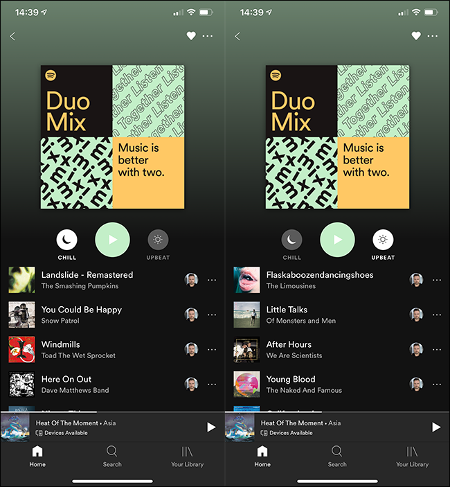

# Music Match Maker
### A Song Analyzer giving suggestions on what my partner may like from my Spotify playlists based on Listening Histories and Song Features

(Image: Spotify)

 Spotify is testing a new subscription called Premium Duo that offers two Premium subscriptions for two people living in the same house at a discounted price. With Premium Duo, the users still have their own separate Spotify accounts. Duo also introduces a new playlist, the Duo Mix, combining both peoples’ music preferences into one. 

(Image: howtogeek.com)   

  
The ideas of this project partly come from the 'new' feature, Duo Mix. I am curious to know what my partner may like from the songs I listened to in general. (I always got complained for my music choice!) 
